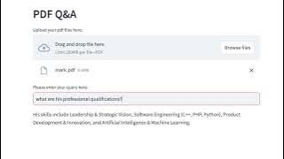

# PDF_QA
A simple app to interact with the uploaded pdf file

Process flow:
--> User uploads a pdf file 
--> The document is splitted into smaller chunks/docs 
--> Stored in FAISS vectorstore 
--> User asks a query through text box 
--> Similar documents are fetched from vectorstore as context 
--> User's question along with context sent to LLM 
--> LLM formats the answer in a structured manner and replies to the user

Click on top of thumbnail to play the video!

